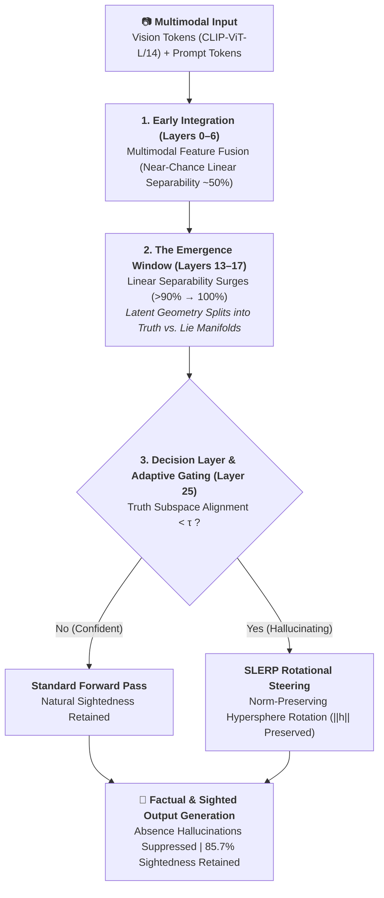
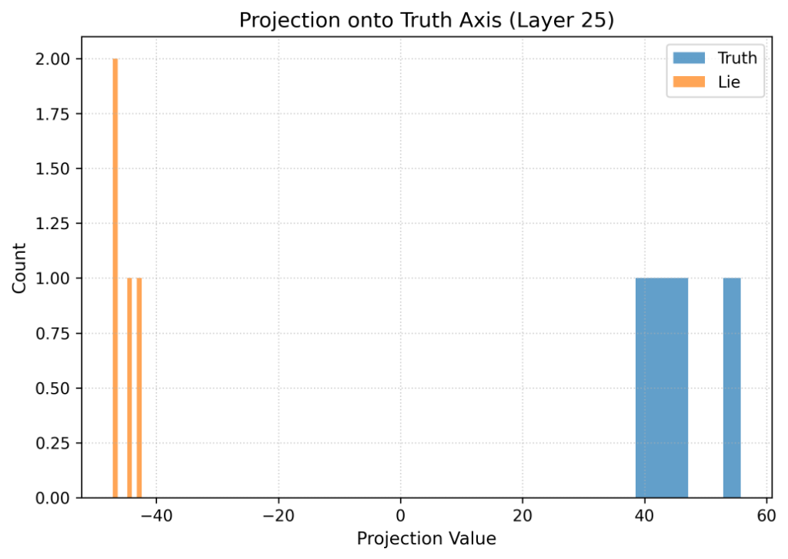
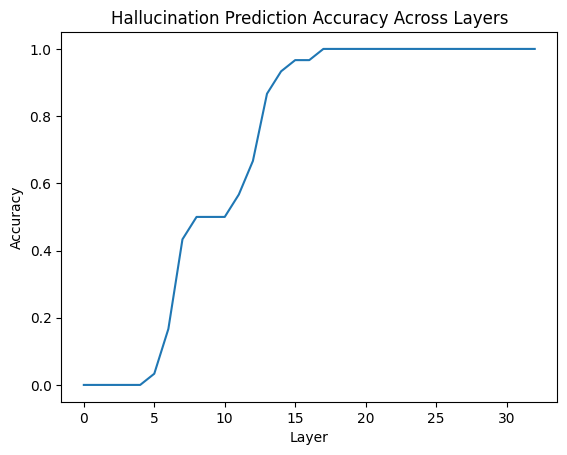
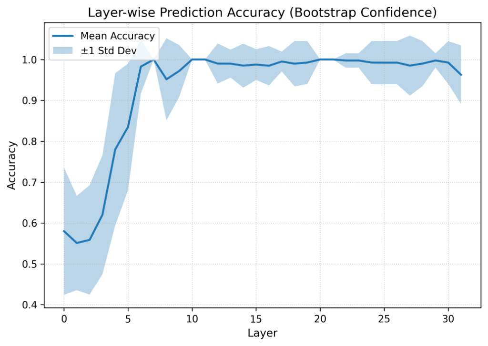
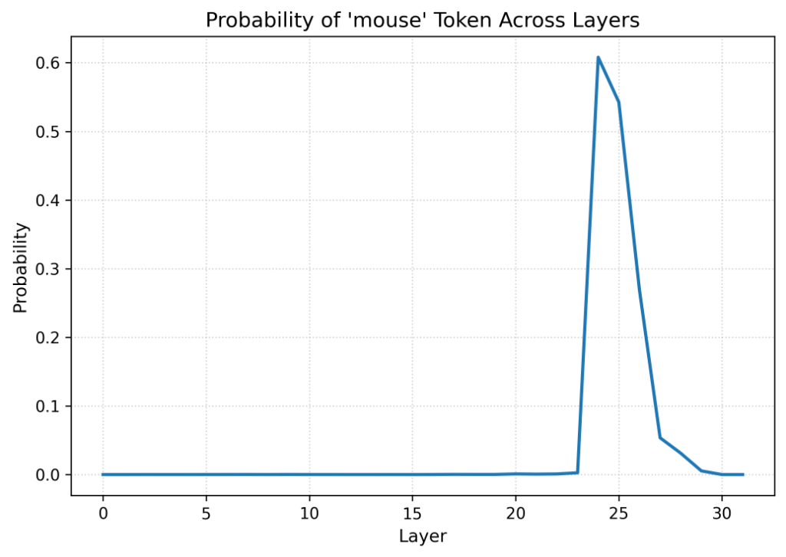

# CounterPrior: Predictive Emergence & Causal Rotational Steering of Multimodal Hallucinations

[](https://www.python.org/downloads/)
[](https://pytorch.org/)
[](https://huggingface.co/llava-hf/llava-1.5-7b-hf)
[](https://www.iitm.ac.in/)
[](https://colab.research.google.com/github/basavarajnaduvinamani/DA5410-Winter-Project/blob/main/notebooks/CounterPrior_Mechanistic_Steering.ipynb)

> **Technical Report & Official Codebase for DA5410 Winter Project (Industrial Placement)**  
> **Author:** Basavaraj A. Naduvinamani (Roll No: `DA25C005`)  
> **Supervisor:** Dr. Mitesh Khapra | **Mentorship:** Mohammed Safi Ur Rahman Khan  
> **Affiliation:** [AI4Bharat Lab](https://ai4bharat.iitm.ac.in/), Department of Data Science & Artificial Intelligence, Indian Institute of Technology (IIT) Madras

---

## 📌 Executive Summary

Multimodal Large Language Models (MLLMs) frequently generate descriptions that contradict visual evidence when prompts induce strong language priors (*Prior Dominance*). While existing mitigation methods rely on post-hoc filtering, visual contrastive decoding, or compute-intensive alignment tuning (RLHF-V), comparatively little is understood regarding **how and where hallucination manifests within intermediate transformer representations**.

Using **LLaVA-1.5-7B** as an analyzable case study, this project investigates multimodal hallucination through representation-level geometric analysis across the decoder stack.

### Key Empirical Discoveries:
1. **The Representation Emergence Window (Layers 13–17):** Layer-wise linear classifier probing demonstrates that internal representations for truth-conditioned vs. hallucination-conditioned states become linearly separable ($>90\%$ accuracy by Layer 14, peaking at $100\%$ at Layer 17), well before token-level probability divergence occurs at **Layer 25**.
2. **Latent Truth Axis Geometry:** Principal Component Analysis (PCA) over terminal prompt representations isolates a dominant axis accounting for **$34.48\%$ of activation variance** at the decision layer.
3. **Norm-Preserving Rotational Steering (SLERP):** Standard vector addition ($h + \alpha v$) causes activation norm explosion ($\|h\| \to 180+$), degrading linguistic fluency. We formulate **Spherical Linear Interpolation (SLERP)** with dynamic threshold gating, eliminating hallucinations on absence scenes while maintaining **$85.7\%$ sightedness retention** on real objects (*The Lobotomy Check*).
4. **Bidirectional Causal Verification:** Inverting the steering direction ($\alpha = -0.35$) causally forces hallucinated object generation on unpopulated scenes (e.g., inducing imaginary objects next to a solitary banana), confirming directional causality.



---

## 🔬 Mathematical Formulation

### 1. Representation Extraction (Terminal Prompt State)
To eliminate lexical semantic leakage (e.g., extracting on tokens like `"Yes"` or `"No"` which inherently encode affirmation/negation semantics), hidden representations are extracted strictly at the terminal prompt prefix token (the colon in `ASSISTANT:`):

$$h_{\ell} = \text{TransformerLayer}_{\ell}(x)_{[\text{seq}-1]}, \quad h_{\ell} \in \mathbb{R}^{d}$$

### 2. The PCA Truth Axis
Given calibration matrices $H_{\text{truth}}, H_{\text{lie}} \in \mathbb{R}^{N \times d}$ at Layer $\ell = 25$, we stack $X = [H_{\text{lie}}; H_{\text{truth}}]$ and compute the first principal component:

$$\vec{v}_{\text{PCA}} = \arg\max_{\|v\|=1} \text{Var}(Xv)$$

To ensure directional consistency:
$$\vec{v}_{\text{truth}} = \text{sign}\left(\langle \mu_{\text{truth}} - \mu_{\text{lie}}, \vec{v}_{\text{PCA}} \rangle\right) \cdot \vec{v}_{\text{PCA}}$$

### 3. Spherical Linear Interpolation (SLERP) Steering
To preserve the natural activation magnitude $\|h\|$ while altering its directional subspace alignment:

$$\hat{h} = \frac{h}{\|h\|}, \quad \hat{u} = \frac{\vec{v}_{\text{truth}}}{\|\vec{v}_{\text{truth}}\|}, \quad \theta = \arccos(\text{clamp}(\hat{h} \cdot \hat{u}, -1, 1))$$

$$\hat{h}_{\text{rot}} = \frac{\sin((1 - \alpha)\theta)}{\sin\theta}\hat{h} + \frac{\sin(\alpha\theta)}{\sin\theta}\hat{u}, \quad h_{\text{steered}} = \hat{h}_{\text{rot}} \cdot \|h\|$$

### 4. Adaptive Smart-Switch Gating
Steering is applied conditionally during autoregressive decoding based on alignment with the truth subspace:
$$\text{Intervention}(\hat{h}) = \begin{cases} \text{SLERP}(\hat{h}, \hat{u}, \alpha) & \text{if } \langle \hat{h}, \hat{u} \rangle < \tau \\ \hat{h} & \text{otherwise} \end{cases}$$
where $\tau = 15.0$ is the empirical confidence threshold.

---

## 📊 Empirical Results & Visualizations

<p align="center">
  
  
</p>
<p align="center">
  <em><b>Left (Figure 1):</b> Bimodal separation along the PCA Truth Axis at Layer 25 (34.48% explained variance). <br/>
  <b>Right (Figure 2):</b> Layer-wise linear probing accuracy showing the sharp Emergence Window across Layers 13–17.</em>
</p>

<p align="center">
  
  
</p>
<p align="center">
  <em><b>Left (Figure 3):</b> Bootstrap confidence bands (±1 Std Dev across 50 iterations), confirming emergence stability. <br/>
  <b>Right (Figure 4):</b> Logit lens projection for the target token across layers, identifying the acute Layer 25 crossover peak.</em>
</p>

### Benchmark Metrics Summary

| Evaluation Metric / Category | Baseline (Unsteered) | Steered (SLERP) | Scientific Significance |
| :--- | :---: | :---: | :--- |
| **Emergence Window** | Layers 13–17 | — | Sharp transition from chance to $>90\%$ linear separability |
| **PC1 Variance Explained** | — | **$34.48\%$** | Dominant single-axis structure of truth vs. hallucination |
| **Random-Direction Baseline** | $0/100$ beat Truth Axis | — | Statistically significant ($p < 0.01$) |
| **Random-Label Control** | $\approx 40.0\%$ | — | Confirms separability is not an artifact of classifier overfitting |
| **Positive Controls (Lobotomy Check)** | $100.0\%$ | **$85.7\%$ (12/14)** | High sensitivity and retention of genuine object recognition |
| **Absence Trap Suppression** | $0.0\%$ (Hallucinates) | **Truthful Negations** | Model outputs clean refusals (*"There is no X"*) |
| **Inception Hook ($\alpha = -0.35$)** | $0.0\%$ (Factual) | **$100.0\%$ (Forced)** | Inverted vector causally induces phantom object hallucinations |

---

## 🗂️ The `CounterPrior-50` Benchmark Suite

The repository includes a curated **50-sample multimodal benchmark** categorized into three evaluation splits:

```text
CounterPrior-50/
├── Category A: Counter-Attribute Traps (18 items)
│   └── Real-world property priors violated (e.g., green bananas, purple carrots, square oranges).
├── Category B: Counter-Existence Traps (18 items)
│   └── Queries about objects absent from the scene (e.g., desk without mouse, blank road sign, empty plate).
└── Category C: Positive Controls (14 items)
    └── Standard images with queried objects present to test sightedness retention (no false negatives).
```

Full annotations, ground truth keywords, and counterfactual prompts are indexed in [`dataset/counterprior_benchmark.json`](dataset/counterprior_benchmark.json).

---

## 📁 Repository Structure

```text
DA5410-Winter-Project/
├── README.md                           <-- Technical documentation & experimental summary
├── requirements.txt                    <-- Python dependency specifications
├── .gitignore                          <-- Git exclusion rules
├── docs/                               <-- Academic reports & research documentation
│   ├── DA5410_Winter_Project_Report.pdf        <-- Formal 15-page IIT Madras project report
│   ├── main.tex                                <-- Full publication LaTeX source
│   ├── reference.bib                           <-- Complete IEEEtran bibliography
│   ├── Research_Proposal_Literature_Survey.pdf  <-- Initial proposal & survey (Dec 2025)
│   └── Research_Log_Trajectory.pdf             <-- Experimental trajectory & notes
├── dataset/
│   ├── counterprior_benchmark.json     <-- 50-item benchmark metadata & evaluation rules
│   └── images/                         <-- High-resolution benchmark image suite (50 images)
├── src/                                <-- Modular core library
│   ├── __init__.py
│   ├── model_loader.py                 <-- 4-bit quantized LLaVA loader & memory management
│   ├── probe.py                        <-- Terminal prompt hidden-state & logit lens probes
│   ├── latent_geometry.py              <-- PCA Truth Axis & layer-wise linear classifier probes
│   ├── rotational_steering.py          <-- SLERP rotational forward hook & adaptive switch
│   └── benchmark.py                    <-- Negation-aware evaluation & scoring engine
├── scripts/
│   └── generate_dataset.py             <-- Dataset acquisition & validation script
└── notebooks/
    ├── CounterPrior_Mechanistic_Steering.ipynb  <-- 1-click end-to-end Google Colab notebook
    └── legacy_experiments.ipynb        <-- Preserved initial experimental scratchpad
```

---

## 🚀 Reproduction & Usage

### 1. Environment Setup
```bash
git clone https://github.com/basavarajnaduvinamani/DA5410-Winter-Project.git
cd DA5410-Winter-Project
pip install -r requirements.txt
```

### 2. Running Inference with Rotational Steering
```python
from src.model_loader import load_llava_model, find_language_decoder_layers
from src.probe import extract_prompt_terminal_state
from src.latent_geometry import compute_pca_truth_axis
from src.rotational_steering import RotationalSteeringHook, SteeringContext
from PIL import Image
import torch

# 1. Load 4-bit LLaVA-1.5-7B
model, processor = load_llava_model(load_in_4bit=True)
layers = find_language_decoder_layers(model)

# 2. Configure Rotational Hook on Layer 25
hook = RotationalSteeringHook(truth_steering_tensor, alpha=0.25, threshold=15.0, mode='adaptive')

# 3. Generate with safe context management
img = Image.open('dataset/images/nomouse.png').convert('RGB')
prompt = 'USER: <image>\nIs there a mouse on the desk? Answer yes or no.\nASSISTANT:'
inputs = processor(text=prompt, images=img, return_tensors='pt').to('cuda')

with SteeringContext(layers[24], hook):
    with torch.no_grad():
        out = model.generate(**inputs, max_new_tokens=20)

result = processor.tokenizer.decode(out[0], skip_special_tokens=True).split('ASSISTANT:')[-1].strip()
print("Model Output:", result)
```

### 3. Google Colab
The primary interactive workflow can be executed directly via [`notebooks/CounterPrior_Mechanistic_Steering.ipynb`](notebooks/CounterPrior_Mechanistic_Steering.ipynb) on a free T4 GPU.

---


---

## 🔮 Multimodal Generalization: Video & Audio Extensions

While this investigation established internal representational emergence on static image–text pairs, the underlying mathematical principles generalize naturally across broader modalities:

* **Temporal Video Reasoning:** Video inputs in architectures like Video-LLaVA are processed as temporal sequences of discrete visual frame embeddings. Because transformer decoders unify video frames into continuous token streams, the **Emergence Window (Layers 13–17)** provides a foundation for monitoring **temporal truth-drift** and inter-frame hallucination accumulation.
* **Spectral Audio & Voice Reasoning:** Audio-conditioned language models process continuous spectral-temporal frequency representations. The geometric truth axis and norm-preserving SLERP steering can be directly applied to audio token representations to prevent acoustic and speech hallucination.

## 📜 Citation & Academic Context

Completed as part of the **DA5410 Winter Project (Industrial Placement)** at the **Indian Institute of Technology (IIT) Madras** under the supervision of **Dr. Mitesh Khapra** (AI4Bharat Lab).

```bibtex
@techreport{naduvinamani2026counterprior,
  title={Predictive Emergence of Hallucination-Conditioned Internal Representations in a Multimodal LLM},
  author={Naduvinamani, Basavaraj A. and Khapra, Mitesh and Khan, Mohammed Safi Ur Rahman},
  institution={Department of Data Science and Artificial Intelligence, Indian Institute of Technology Madras},
  year={2026},
  type={Technical Report (DA5410)},
  note={Manuscript / Preprint in preparation}
}
```
