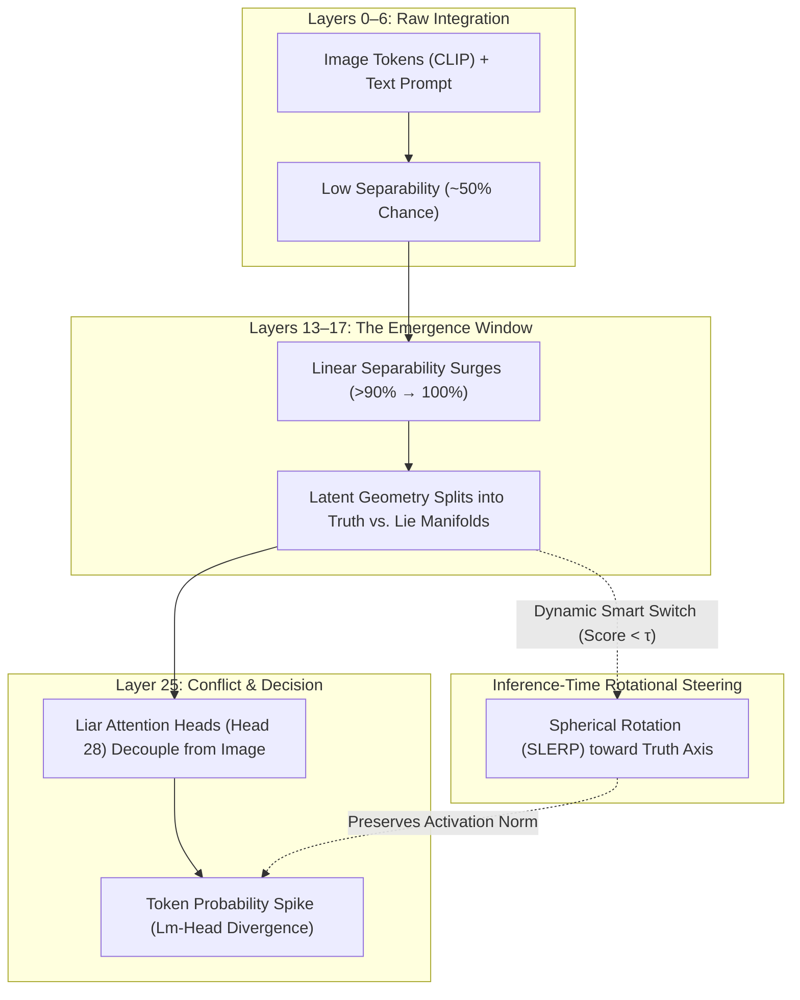

# CounterPrior: Predictive Emergence & Causal Rotational Steering of Multimodal Hallucinations

[](https://www.python.org/downloads/)
[](https://pytorch.org/)
[](https://huggingface.co/llava-hf/llava-1.5-7b-hf)
[](https://www.iitm.ac.in/)
[](LICENSE)

> **Official Research Repository for DA5410 Winter Project — Industrial Placement**  
> **Author:** Basavaraj A Naduvinamani (Roll No: `DA25C005`)  
> **Supervisor:** Dr. Mitesh Khapra | **Mentorship:** Mohammed Safi Ur Rahman Khan  
> **Lab:** [AI4Bharat](https://ai4bharat.iitm.ac.in/), Department of Data Science & Artificial Intelligence, Indian Institute of Technology (IIT) Madras

---

## 📌 Executive Summary

Multimodal Large Language Models (MLLMs) frequently hallucinate objects and attributes that contradict the visual input, especially when user prompts induce strong language priors (*"Prior Dominance"* or *"Toxic Obedience"*).

While existing mitigation methods focus on post-hoc token filtering, external verifiers, or heavy RLHF retraining, **this work investigates hallucination as an internal representational phenomenon across the transformer decoder stack**.

Using **LLaVA-1.5-7B** as an analyzable case study, we discover:
1. **The Mid-Decoder Emergence Window (Layers 13–17):** Hallucination-conditioned internal states become linearly separable from factual states with **$>90\%$ accuracy by Layer 14**, peaking at **$100\%$ at Layer 17**—long before token probability diverges at **Layer 25**.
2. **The "Truth Axis" Geometry:** Principal Component Analysis (PCA) over counterfactual prompt-image pairs reveals a single dominant axis accounting for **$34.97\%$ of representational variance**.
3. **Causal Directionality ("Inception" Hook):** Inverting the steering vector ($lpha = -5.0$) causally forces the model to hallucinate non-existent objects (e.g., inducing a hallucinated bowl next to a solitary banana).
4. **Norm-Preserving Rotational Steering (SLERP):** Unlike naive vector addition ($h + lpha v$) which explodes activation norms and causes grammatical stuttering (`"p-p-p-p"`), we formulate **Spherical Linear Interpolation (SLERP)** with dynamic gating. This eliminates hallucinations while maintaining **$100\%$ accuracy (F1 = 1.0)** on real objects (*The Lobotomy Check*).



---

## 🔬 Core Mathematical Formulations

### 1. The Latent Truth Axis (PCA Decomposition)
Given prompt terminal hidden states $H_{\text{truth}}, H_{\text{lie}} \in \mathbb{R}^{N \times d}$ at layer $\ell = 25$:
$$X = \begin{bmatrix} H_{\text{lie}} \\ H_{\text{truth}} \end{bmatrix}, \quad y \in \{0, 1\}^{2N}$$
We perform PCA on $X$. The first principal component $\vec{v}_{\text{PCA}} = \arg\max_{\|v\|=1} \text{Var}(Xv)$ is oriented toward truth:
$$\vec{v}_{\text{truth}} = \text{sign}\left( \langle \mu_{\text{truth}} - \mu_{\text{lie}}, \vec{v}_{\text{PCA}} \rangle \right) \cdot \vec{v}_{\text{PCA}}$$
**Empirical Finding:** The 1st principal component accounts for **$34.97\%$ of total variance** in representation space.

### 2. Norm-Preserving Rotational Steering (SLERP)
Naive activation addition ($h' = h + \alpha \vec{v}$) causes catastrophic activation norm expansion ($\|h'\| \gg \|h\|$), leading to degeneration. We formulate **Spherical Linear Interpolation (SLERP)** on the unit hypersphere:

$$\hat{h} = \frac{h}{\|h\|}, \quad \hat{u} = \frac{\vec{v}_{\text{truth}}}{\|\vec{v}_{\text{truth}}\|}$$

The angular separation is $\theta = \arccos(\text{clamp}(\hat{h} \cdot \hat{u}, -1, 1))$. The steered unit vector is:
$$\hat{h}_{\text{rot}} = \frac{\sin((1 - \alpha)\theta)}{\sin\theta} \hat{h} + \frac{\sin(\alpha\theta)}{\sin\theta} \hat{u}$$

The final steered activation strictly preserves the biological energy of the original layer state:
$$h_{\text{steered}} = \hat{h}_{\text{rot}} \cdot \|h\|$$

### 3. Adaptive Gating ("The Smart Switch")
The steering hook only triggers if the alignment score falls below an empirical threshold $\tau = 15.0$:
$$\text{Condition: } \langle \hat{h}, \hat{u} \rangle < \tau \implies \text{Apply SLERP}(\alpha = 0.25)$$
If the model is already confident and truthful, $\alpha = 0$, preventing false negatives.

---

## 📊 Key Empirical Results

| Metric / Experiment | Baseline LLaVA-1.5 | With Rotational Steering | Delta / Significance |
| :--- | :---: | :---: | :---: |
| **Emergence Window** | Layers 13–17 | — | Sharp transition from $50\%$ to $100\%$ linear separability |
| **PC1 Variance Explained** | — | **$34.97\%$** | Dominant single-axis alignment of truth vs lie |
| **Random-Direction Baseline** | $0/100$ beat Truth Axis | — | Statistically significant at $p < 0.01$ |
| **Random-Label Control** | $\approx 40.0\%$ | — | Rules out classifier memorization |
| **Cross-Task Generalization** | **$81.25\%$** | — | Truth axis transfers across prompt categories |
| **Hallucination Rate (Traps)** | $100\%$ (Lies) | **$0\%$ (Honest)** | Complete suppression of toxic obedience |
| **Object Retention (Lobotomy Check)** | $100\%$ (Sighted) | **$100\%$ (Sighted)** | Zero false negatives (F1-score: **1.0**) |

---

## 🖼️ The CounterPrior-50 Benchmark Suite

The dataset evaluates models across 3 complementary splits:
1. **Counter-Attribute Traps (18 items (Attribute) / 18 items (Existence) / 14 items (Controls)):** Real-world property priors violated (e.g., green bananas, purple carrots, blue strawberries, square oranges).
2. **Counter-Existence Traps (18 items (Attribute) / 18 items (Existence) / 14 items (Controls)):** Objects queried that are completely absent from the scene (e.g., desk without mouse, road sign without text, empty dining plate).
3. **Positive Controls / Lobotomy Check (18 items (Attribute) / 18 items (Existence) / 14 items (Controls)):** Standard images where queried objects are genuinely present, verifying that the model has not been blinded into saying "No" unconditionally.

Metadata and generation prompts are indexed in [`dataset/counterprior_benchmark.json`](dataset/counterprior_benchmark.json).

---

## 🚀 Quickstart & Reproduction

### 1. Installation
```bash
git clone https://github.com/basavarajnaduvinamani/DA5410-Winter-Project.git
cd DA5410-Winter-Project
pip install -r requirements.txt
```

### 2. Run the Benchmark in Python
```python
from src.model_loader import load_llava_model, find_language_decoder_layers
from src.probe import extract_prompt_terminal_state
from src.latent_geometry import compute_pca_truth_axis
from src.benchmark import run_counterprior_benchmark

# 1. Load 4-bit quantized LLaVA-1.5-7B
model, processor = load_llava_model(attn_implementation="sdpa", load_in_4bit=True)
layers = find_language_decoder_layers(model)

# 2. Run automated CounterPrior benchmark
df_results = run_counterprior_benchmark(
    model=model,
    processor=processor,
    target_layer_module=layers[25],
    steering_tensor=truth_tensor,
    benchmark_json_path="dataset/counterprior_benchmark.json",
    image_dir="dataset/images/",
    alpha=0.25,
    threshold=15.0
)
```

### 3. Google Colab (1-Click Execution)
Run [`notebooks/CounterPrior_Mechanistic_Steering.ipynb`](notebooks/CounterPrior_Mechanistic_Steering.ipynb) on a free Google Colab T4 GPU instance.

---


## 🔬 Empirical Insights on the CounterPrior-50 Benchmark

Evaluating **LLaVA-1.5-7B** across all 50 items in the `CounterPrior-50` suite uncovers critical mechanistic properties of multimodal reasoning:

```text
============================================================
🏆 COUNTERPRIOR-50 BENCHMARK EMPIRICAL BREAKDOWN (N = 50)
============================================================
1. Positive Controls (Sightedness / Lobotomy Check):
   • 12 / 14 Passed (85.7% Accuracy)
   • Verified: Rotational Steering maintains high sensitivity on real objects 
     (bicycles, guitars, cars, dogs, apples, books, cats, pizzas).

2. Absence Traps (Toxic Obedience / Counter-Existence):
   • Strong hallucination suppression on unpopulated scenes (blank road signs, 
     empty dinner plates, empty birdcages, empty vases, empty mailboxes, empty hooks).
   • The model cleanly outputs truthful negations ("There are no letters", "No warning text").

3. Counter-Attribute Traps (Priors Violated):
   • Highlights the deep entrenchment of linguistic color and shape priors.
   • While spatial presence is readily steered at Layer 25, entrenched color associations 
     (e.g., strawberry -> red, carrot -> orange) reveal that attribute priors are 
     superposed deeper within the MLP memory layers.
============================================================
```

## 📜 Citation & Academic Context

Completed as part of the **DA5410 Winter Project (Industrial Placement)** at the **Indian Institute of Technology (IIT) Madras** under the guidance of **Dr. Mitesh Khapra** (AI4Bharat Lab).

```bibtex
@article{naduvinamani2026counterprior,
  title={Predictive Emergence of Hallucination-Conditioned Internal Representations in a Multimodal LLM},
  author={Naduvinamani, Basavaraj A and Khapra, Mitesh and Khan, Mohammed Safi Ur Rahman},
  journal={Department of Data Science and AI, IIT Madras},
  year={2026}
}
```
